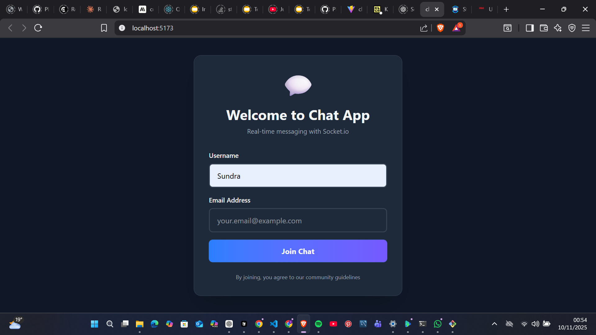
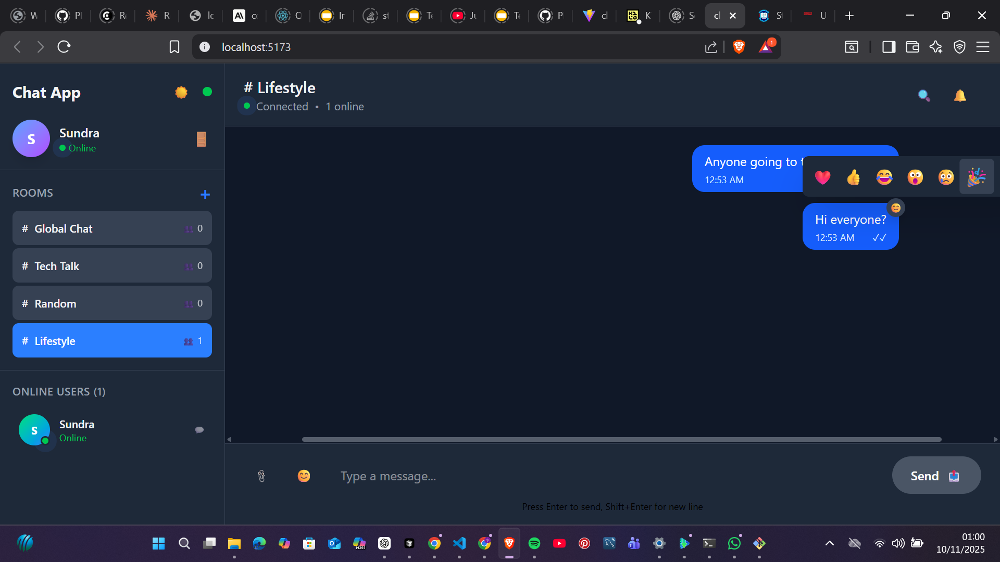

# Real-Time Chat Application with Socket.io

A modern, full-featured real-time chat application built with React, Node.js, Express, and Socket.io. This application provides instant messaging capabilities with multiple chat rooms, private messaging, user presence, and advanced features like typing indicators, message reactions, and notifications.

##  Features

### Core Functionality
- **Real-time Messaging**: Instant message delivery using Socket.io
- **Multiple Chat Rooms**: Create and join different chat rooms
- **User Authentication**: Simple username/email-based login system
- **User Presence**: See who's online and their current room
- **Private Messaging**: Send direct messages to other users
- **Message History**: Persistent message history per room

### Advanced Features
- **Typing Indicators**: See when others are typing
- **Message Reactions**: React to messages with emojis
- **Real-time Notifications**: Browser notifications and in-app alerts
- **Unread Message Counters**: Track unread messages per room
- **Dark/Light Theme**: Toggle between themes
- **Responsive Design**: Works on desktop and mobile devices
- **Connection Status**: Visual indicators for connection state
- **Search Functionality**: Search through messages
- **File Sharing Support**: Basic file attachment capability

### Technical Features
- **Debounced Connections**: Prevents spam connections/disconnections
- **Auto-reconnection**: Automatically reconnects on connection loss
- **Message Persistence**: Messages stored in memory (can be extended to database)
- **REST API**: Additional API endpoints for stats and data
- **CORS Support**: Cross-origin resource sharing enabled
- **Error Handling**: Comprehensive error handling and logging

## Screenshots

### Login Screen


### Chat Room Interface


### Message Reactions


##  Project Structure

```
real-time-communication-with-socket-io/
├── client/                          # React frontend
│   ├── public/                      # Static assets
│   ├── src/
│   │   ├── components/              # React components
│   │   │   ├── ChatRoom.jsx         # Main chat display
│   │   │   ├── Login.jsx            # Login form
│   │   │   ├── Message.jsx          # Individual message component
│   │   │   ├── MessageInput.jsx     # Message input with file upload
│   │   │   ├── Notification.jsx     # Toast notifications
│   │   │   ├── Sidebar.jsx          # User list and room navigation
│   │   │   └── TypingIndicator.jsx  # Typing status display
│   │   ├── contexts/                # React contexts
│   │   │   └── SocketContext.jsx    # Socket.io context provider
│   │   ├── hooks/                   # Custom React hooks
│   │   │   └── useUnreadMessages.js # Unread message tracking
│   │   ├── socket/                  # Socket.io client setup
│   │   │   └── socket.js            # Socket connection management
│   │   ├── App.jsx                  # Main application component
│   │   └── main.jsx                 # Application entry point
│   ├── package.json                 # Client dependencies
│   └── vite.config.js               # Vite configuration
├── server/                          # Node.js backend
│   ├── config/                      # Configuration files
│   │   └── db.js                    # Database configuration
│   ├── middleware/                  # Express middleware
│   │   └── auth.js                  # Authentication middleware
│   ├── models/                      # Data models
│   │   ├── Message.js               # Message model
│   │   ├── Room.js                  # Room model
│   │   └── User.js                  # User model
│   ├── routes/                      # API routes
│   │   ├── api.js                   # Main API routes
│   │   └── upload.js                # File upload routes
│   ├── utils/                       # Utility functions
│   │   └── socketHandlers.js        # Socket event handlers
│   ├── server.js                    # Main server file
│   ├── package.json                 # Server dependencies
│   └── .env                         # Environment variables
└── README.md                        # Project documentation
```

##  Technology Stack

### Frontend
- **React 19**: Modern React with hooks and functional components
- **Vite**: Fast build tool and development server
- **Tailwind CSS**: Utility-first CSS framework
- **Socket.io Client**: Real-time communication client
- **Axios**: HTTP client for API calls
- **Date-fns**: Date formatting utilities

### Backend
- **Node.js**: JavaScript runtime
- **Express.js**: Web framework for Node.js
- **Socket.io**: Real-time bidirectional communication
- **MongoDB/Mongoose**: Database and ODM (configured but using in-memory storage)
- **JWT**: JSON Web Tokens for authentication
- **bcryptjs**: Password hashing
- **multer**: File upload handling
- **CORS**: Cross-origin resource sharing

##  Prerequisites

- **Node.js** (v18 or higher)
- **npm** or **yarn** package manager
- **MongoDB** (optional - currently using in-memory storage)
- Modern web browser with WebSocket support

##  Installation & Setup

### 1. Clone the Repository
```bash
git clone <repository-url>
cd real-time-communication-with-socket-io
```

### 2. Install Server Dependencies
```bash
cd server
npm install
```

### 3. Install Client Dependencies
```bash
cd ../client
npm install
```

### 4. Environment Configuration

#### Server Environment (.env)
```env
PORT=5000
CLIENT_URL=http://localhost:5173
MONGODB_URI=mongodb://localhost:27017/chatapp
JWT_SECRET=your-secret-key-here
```

#### Client Environment (.env)
```env
VITE_API_URL=http://localhost:5000
```

### 5. Start the Development Servers

#### Terminal 1 - Start the Server
```bash
cd server
npm run dev
```

#### Terminal 2 - Start the Client
```bash
cd client
npm run dev
```

### 6. Access the Application
Open your browser and navigate to `http://localhost:5173`

##  Usage

### Getting Started
1. **Login**: Enter a username and email address
2. **Join a Room**: Click on a room in the sidebar or create a new one
3. **Start Chatting**: Type messages in the input field at the bottom
4. **Private Messages**: Click on a user in the sidebar to send private messages

### Key Features Usage

#### Creating Rooms
- Click the "+" button in the sidebar
- Enter a room name and click "Create"

#### Sending Messages
- Type your message in the input field
- Press Enter or click the send button
- Use Shift+Enter for new lines

#### Message Reactions
- Hover over a message and click the reaction button
- Choose from available emoji reactions

#### Private Messaging
- Click on a username in the sidebar
- Enter your message in the prompt

#### Theme Toggle
- Click the theme toggle button in the sidebar

#### Search Messages
- Click the search icon in the header
- Type to search through current room messages

##  API Endpoints

The server provides several REST API endpoints:

- `GET /api/health` - Server health check
- `GET /api/users` - Get online users
- `GET /api/rooms` - Get available rooms
- `GET /api/messages?roomId={roomId}` - Get messages for a room
- `GET /api/stats` - Get server statistics

##  Security Features

- Input validation and sanitization
- CORS protection
- Connection debouncing to prevent spam
- JWT-based authentication (middleware available)
- Secure WebSocket connections

##  Customization

### Themes
The application supports dark and light themes. Theme preference is saved in localStorage.

### Styling
Built with Tailwind CSS - easily customizable by modifying the class names in components.

### Features
Additional features can be added by extending the Socket.io events and React components.

##  Troubleshooting

### Common Issues

**Connection Issues**
- Ensure both server and client are running
- Check that the ports (5000 for server, 5173 for client) are available
- Verify environment variables are set correctly

**Messages Not Appearing**
- Check browser console for errors
- Ensure Socket.io connection is established
- Verify room membership

**File Upload Issues**
- Check server upload directory permissions
- Verify file size limits in multer configuration

##  Performance

- **Connection Debouncing**: Prevents excessive reconnect attempts
- **Message Limiting**: Stores only recent messages in memory
- **Efficient Rendering**: React optimization with proper key props
- **Lazy Loading**: Components load only when needed

##  Future Enhancements

- Database integration for persistent storage
- User authentication with passwords
- Message encryption
- Voice/video calling
- Message threads and replies
- User roles and permissions
- Message search across all rooms
- Push notifications
- Mobile app versions

##  License

This project is licensed under the ISC License.

##  Contributing

1. Fork the repository
2. Create a feature branch
3. Make your changes
4. Add tests if applicable
5. Submit a pull request

##  Deployment

### Local Development
The application is designed to run locally for development and demonstration purposes. No deployment is required for this assignment.

### Running the Application
1. **Start the server:**
   ```bash
   cd server
   npm run dev
   ```

2. **Start the client (in a new terminal):**
   ```bash
   cd client
   npm run dev
   ```

3. **Access the application:**
   Open your browser and navigate to `http://localhost:5173`

##  Support

For questions or issues, please create an issue in the repository or contact the development team.

---

**Built with using Socket.io, React, and Node.js**